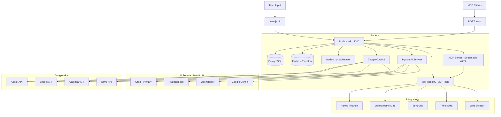

# 🤖 Smart Workflow Automation

**Transform plain English into powerful automations with AI + MCP + Google Integration**

[](#-ai-providers)
[](https://modelcontextprotocol.io/)
[](#-google-integrations)
[](https://workflow-automation-green.vercel.app/)

---

> **⚠️ Copyright Notice**
> This project is developed and maintained by **[@jayyycodes](https://github.com/jayyycodes)**. All rights reserved. See [LICENSE](#-license) for usage terms. Unauthorized redistribution or commercial use without permission is prohibited.

---

## ✨ What Is This?

Smart Workflow Automation lets you create complex automations using **plain English**. Powered by a multi-LLM AI engine with a full **Model Context Protocol (MCP)** server and **Google OAuth integrations**, it understands your intent, builds workflows automatically, and connects to your Google account for Gmail, Sheets, Calendar, and Drive.

### Just say:
- _"Fetch Bitcoin price and email me via Gmail"_ → ✅ Done
- _"Check AAPL stock every 5 minutes and save to Google Sheets"_ → ✅ Done
- _"Email me top HackerNews stories every morning"_ → ✅ Done
- _"Create a calendar event for team standup tomorrow at 10am"_ → ✅ Done
- _"Send me weather updates on WhatsApp daily at 8 AM"_ → ✅ Done

No coding required. Just natural language.

---

## 🎯 Live Demo

**Try it yourself:** [Live App](https://workflow-automation-green.vercel.app/)

---

## 🚀 Features

### 🤖 **Multi-LLM AI Engine**
- **4-provider cascade**: Groq → HuggingFace → OpenRouter → Google Gemini
- Natural language → JSON workflows with auto-retry
- Smart entity extraction + context-aware clarification
- **Self-healing AI**: auto-validates & fixes malformed workflows

### 🔐 **Google OAuth Integration**
- **Sign in with Google** — single sign-on with full API access
- **Gmail** — Send emails via user's own Gmail account
- **Google Sheets** — Read, write, append data (auto-creates spreadsheets)
- **Google Calendar** — Create events, list upcoming events
- **Google Drive** — Upload files to user's Drive
- Per-user OAuth tokens stored securely in Firestore

### 🔌 **MCP Server (Model Context Protocol)**
- **Streamable HTTP** transport at `POST /mcp`
- **17+ tools** dynamically discoverable by any MCP client
- Compatible with **Claude Desktop, Cursor, Windsurf**, and all MCP clients
- ContextMemory + execution logging for every tool call
- Stateless mode — optimized for cloud deployment (Render)

### 📋 **Tool Registry (30+ Tools)**
- Centralized registry with JSON Schema definitions
- 8 categories: `data_fetch`, `web_scraping`, `data_transform`, `notification`, `action`, `control_flow`, `google_oauth`
- Dynamic handler linking at startup
- MCP-ready with `inputSchema` for each tool

### 📊 **Real-Time Data Integrations**
- **Stock Prices**: Yahoo Finance (real-time)
- **Crypto**: Bitcoin, Ethereum, and more
- **Weather**: OpenWeatherMap
- **Web Scraping**: HackerNews, GitHub, Reddit, Discord
- **Notifications**: Email (SendGrid), Gmail, SMS (Twilio), WhatsApp, Slack, Discord

### ⚡ **Production-Ready Architecture**
- **Workflow Validator**: validates steps before execution
- **Context Memory**: passes data between workflow steps
- **Execution Logger**: full state tracking with Firebase
- **Auto port-conflict resolution**: handles EADDRINUSE gracefully
- **Cron Scheduling** for recurring automations
- **PostgreSQL** for data persistence
- **Graceful shutdown** handling

### 🎨 **Beautiful Terminal UI**
- Hacker/terminal dark theme
- Responsive design
- Real-time execution status
- Framer Motion animations

---

## 🛠️ Tech Stack

**Frontend:**
- Next.js 14 (App Router) + React + TailwindCSS + Framer Motion

**Backend (Node.js):**
- Express.js + PostgreSQL + Firebase/Firestore + Node-cron + MCP SDK

**Backend (Python AI):**
- FastAPI + Multi-LLM (Groq, HuggingFace, OpenRouter, Gemini)

**Google APIs:**
- OAuth2 (Sign-in + API access) · Gmail API · Sheets API · Calendar API · Drive API

**MCP Server:**
- `@modelcontextprotocol/sdk` (Streamable HTTP, stateless)
- 17+ MCP-exposable tools with JSON Schema
- ContextMemory + ExecutionLogger integration

**Integrations:**
- SendGrid (email) · Twilio (SMS/WhatsApp) · Yahoo Finance (stocks) · OpenWeatherMap (weather) · GitHub API · HackerNews API · Reddit · Discord · Slack · Google APIs

---

## 🏗️ Architecture



---

## 🏃 Quick Start

### Prerequisites
- Node.js 18+
- Python 3.9+
- PostgreSQL
- Firebase project (Firestore + service account key)
- Google Cloud project (OAuth2 credentials)
- API keys: At least one of Groq/HuggingFace/OpenRouter/Gemini

### Installation

```bash
# 1. Clone repository
git clone https://github.com/jayyycodes/workflow-automation.git
cd workflow-automation

# 2. Install backend dependencies
npm install

# 3. Install Python AI service dependencies
cd engine-py && pip install -r requirements.txt && cd ..

# 4. Install frontend dependencies
cd Frontend/my-app && npm install && cd ../..

# 5. Set up environment variables
cp .env.example .env
# Edit .env with your API keys (see below)

# 6. Add Firebase service account
# Place your serviceAccountKey.json in the root directory

# 7. Start all services (3 terminals)
npm run dev                                          # Backend (port 3000)
cd engine-py && uvicorn app:app --reload --port 8000 # AI service (port 8000)
cd Frontend/my-app && npm run dev                    # Frontend (port 3001)
```

### Environment Variables

```env
# Required
JWT_SECRET=your-secret-key

# Database
DB_HOST=your-db-host
DB_PORT=5432
DB_USER=your-db-user
DB_PASSWORD=your-db-password
DB_NAME=workflow_automation

# AI Providers (at least one required)
GROQ_API_KEY=your-groq-key          # Primary (fast & free)
HUGGINGFACE_API_KEY=your-hf-key     # Fallback #1
OPENROUTER_API_KEY=your-router-key  # Fallback #2
GEMINI_API_KEY=your-gemini-key      # Fallback #3

# Google OAuth (required for Google integrations)
GOOGLE_CLIENT_ID=your-google-client-id
GOOGLE_CLIENT_SECRET=your-google-client-secret
GOOGLE_REDIRECT_URI=http://localhost:3000/auth/google/callback
FRONTEND_URL=http://localhost:3001

# Notifications
SENDGRID_API_KEY=your-sendgrid-key
EMAIL_FROM=your-email@example.com
TWILIO_ACCOUNT_SID=your-twilio-sid
TWILIO_AUTH_TOKEN=your-twilio-token
TWILIO_PHONE_NUMBER=+1234567890

# Optional
WEATHER_API_KEY=your-openweather-key
DISCORD_WEBHOOK_URL=your-discord-webhook
```

### Google Cloud Setup

1. Go to [Google Cloud Console](https://console.cloud.google.com/)
2. Create a new project or select existing
3. Enable APIs: Gmail, Sheets, Calendar, Drive
4. Go to **Credentials** → Create **OAuth 2.0 Client ID**
5. Add authorized redirect URIs:
   - Local: `http://localhost:3000/auth/google/callback`
   - Production: `https://your-backend.onrender.com/auth/google/callback`
6. Copy Client ID and Secret to `.env`

### Firebase Setup

1. Go to [Firebase Console](https://console.firebase.google.com/)
2. Create a new project
3. Enable **Firestore Database**
4. Go to Project Settings → Service Accounts → Generate new private key
5. Save as `serviceAccountKey.json` in the root directory

---

## 🔌 MCP Server

The backend exposes a fully MCP-compatible endpoint at `POST /mcp`. Any MCP client can dynamically discover and execute tools.

### Quick Test

```bash
# Discover all available tools
curl -X POST http://localhost:3000/mcp \
  -H "Content-Type: application/json" \
  -H "Accept: application/json, text/event-stream" \
  -d '{"jsonrpc":"2.0","id":1,"method":"tools/list","params":{}}'

# Execute a tool
curl -X POST http://localhost:3000/mcp \
  -H "Content-Type: application/json" \
  -H "Accept: application/json, text/event-stream" \
  -d '{"jsonrpc":"2.0","id":2,"method":"tools/call","params":{"name":"fetch_weather","arguments":{"city":"Mumbai"}}}'
```

---

## 🔐 Google Integrations

| Tool | Description |
|------|-------------|
| `send_gmail` | Send email via user's Gmail account |
| `read_google_sheet` | Read data from Google Sheets |
| `write_google_sheet` | Write data to Sheets (auto-creates if no ID) |
| `append_google_sheet` | Append rows to Sheets (auto-creates if no ID) |
| `create_calendar_event` | Create Google Calendar event |
| `list_calendar_events` | List upcoming calendar events |
| `upload_to_drive` | Upload file to Google Drive |
| `list_drive_files` | List files in Google Drive |

---

## 🌟 Example Automations

### 📧 Gmail + Crypto
```
"Fetch Bitcoin price and send me the result via Gmail to me@example.com"
```

### 📊 Sheets + Stock Monitoring
```
"Fetch AAPL stock price every 5 minutes and save to Google Sheets"
```

### 📅 Calendar Events
```
"Create a calendar event called Team Standup for tomorrow at 10am"
```

### 📰 HackerNews Digest
```
"Email me top HackerNews stories about AI every evening"
```

### 🌤️ Weather Alerts
```
"Send me Mumbai weather every morning at 8 AM via WhatsApp"
```

---

## 📦 Project Structure

```
workflow-automation/
├── src/
│   ├── index.js                    # Express server + MCP init + auto port recovery
│   ├── mcp/
│   │   ├── mcpServer.js            # MCP server factory
│   │   └── mcpRoutes.js            # POST /mcp endpoint
│   ├── registry/
│   │   ├── toolRegistry.js         # Centralized tool registry (30+ tools)
│   │   ├── toolDefinitions.json    # JSON Schema definitions
│   │   └── mcpToolAdapter.js       # MCP ↔ Registry bridge
│   ├── automations/
│   │   ├── workflowExecutor.js     # Sequential step executor
│   │   └── stepRegistry.js         # Step handler implementations
│   ├── integrations/
│   │   ├── gmail/                  # Gmail OAuth handler
│   │   ├── sheets/                 # Google Sheets handler (auto-create)
│   │   ├── calendar/               # Google Calendar handler (smart dates)
│   │   └── drive/                  # Google Drive handler
│   ├── services/
│   │   └── googleOAuth.js          # OAuth2 flow + token management
│   ├── config/
│   │   └── firebase.js             # Firebase/Firestore config
│   ├── utils/
│   │   ├── executionLogger.js      # State tracking + ContextMemory
│   │   └── logger.js               # Winston logger
│   └── routes/                     # REST API routes
├── engine-py/                      # Python AI service (FastAPI)
│   ├── app.py                      # Multi-LLM provider cascade
│   ├── config.py                   # LLM configuration
│   ├── prompts.py                  # System prompts + Google tool examples
│   └── validator.py                # Workflow validation
├── Frontend/my-app/                # Next.js 14 frontend
├── serviceAccountKey.json          # Firebase service account (gitignored)
├── render.yaml                     # Render deployment config
└── .env                            # Environment variables (gitignored)
```

---

## 🔥 Production Deployment

### Deploy to Render

1. **Push to GitHub**:
   ```bash
   git add .
   git commit -m "production deployment"
   git push origin main
   ```

2. **Set Environment Variables** in Render dashboard for both services:
   - **Backend (Node.js)**: All `.env` variables + production Google OAuth credentials
   - **Python AI**: `GROQ_API_KEY`, `HUGGINGFACE_API_KEY`, `OPENROUTER_API_KEY`, `GEMINI_API_KEY`

3. **Google Cloud Console**: Add your Render backend URL as authorized redirect URI:
   ```
   https://your-backend.onrender.com/auth/google/callback
   ```

4. **Deploy** — Render auto-deploys on git push!

### Deploy Frontend to Vercel

1. Import your GitHub repo in [Vercel](https://vercel.com)
2. Set root directory to `Frontend/my-app`
3. Add environment variable: `NEXT_PUBLIC_API_URL=https://your-backend.onrender.com`
4. Deploy!

---

## 🤝 Contributing

Contributions welcome! Areas to explore:
- [ ] Twitter/X integration
- [ ] Webhook triggers
- [ ] Custom tool builder UI
- [ ] MCP authentication (OAuth2)
- [ ] More Google integrations (Docs, Meet)

---

## 📄 License

**MIT License** — Copyright (c) 2025 [@jayyycodes](https://github.com/jayyycodes)

Permission is hereby granted, free of charge, to any person obtaining a copy of this software and associated documentation files, to deal in the Software without restriction, including without limitation the rights to use, copy, modify, merge, publish, distribute, sublicense, and/or sell copies of the Software, subject to the following conditions:

**The above copyright notice and this permission notice shall be included in all copies or substantial portions of the Software.**

---

## 🙏 Acknowledgments

- **Groq** — Primary AI engine (fast inference)
- **Google Gemini** — Fallback AI engine
- **Anthropic MCP** — Model Context Protocol standard
- **OpenRouter** — Multi-model routing
- **Firebase** — User token storage & execution logging
- **Render** — Backend deployment
- **Vercel** — Frontend hosting

---

<div align="center">

**⚡ Transform plain English into powerful automations ⚡**

**🔌 MCP-compatible · 30+ tools · Multi-LLM · Google Integrated · Production-ready**

Built with ❤️ by [@jayyycodes](https://github.com/jayyycodes)

Contributor: [@Atharva-Sarn](https://github.com/Atharva-Sarn)

[](https://github.com/jayyycodes/workflow-automation)

</div>
